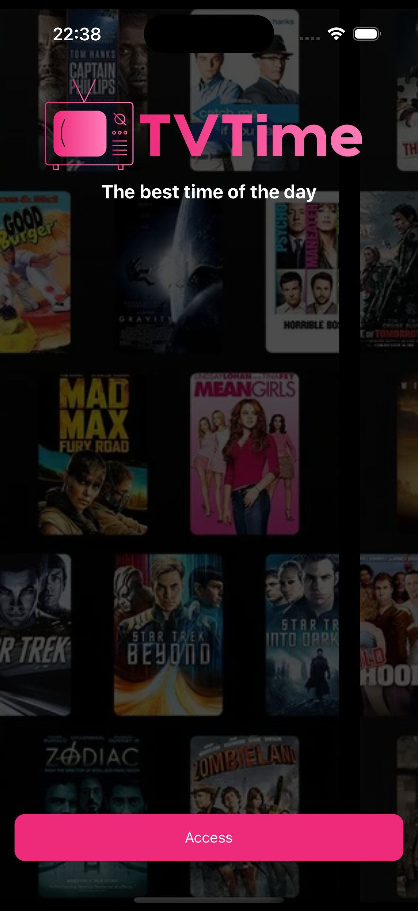
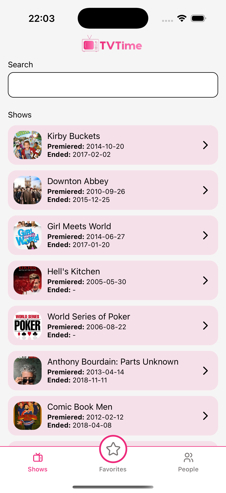
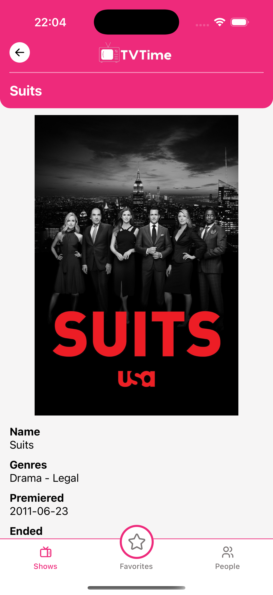
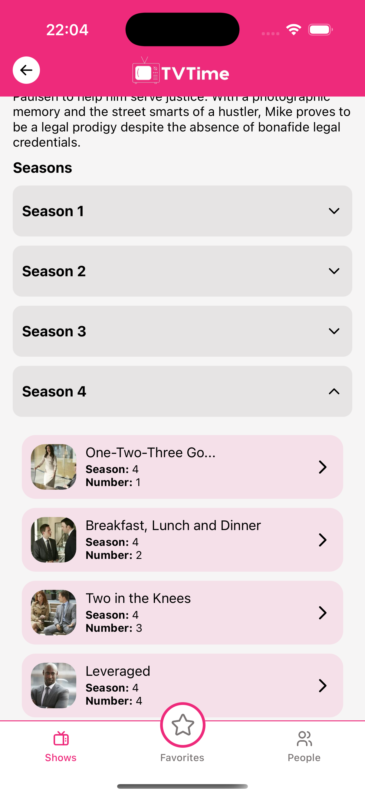
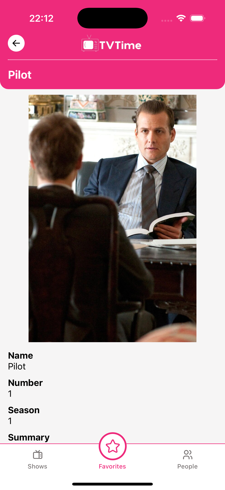
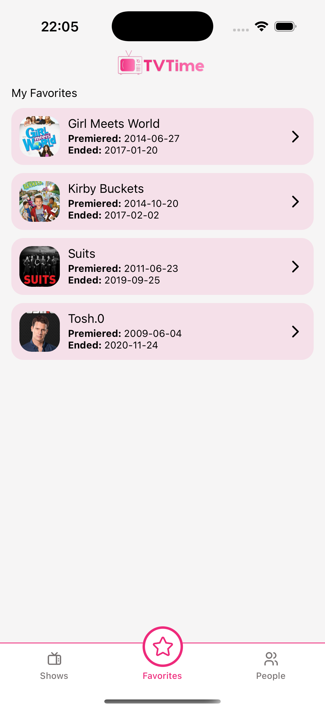
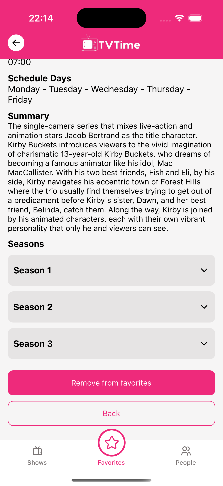

# 📺 TV Series App

Application developed as part of the React Native challenge, using the [TVMaze API](https://www.tvmaze.com/api) to list and retrieve series and episodes information.  
The project follows best coding practices and architecture principles, with special attention to UX and performance.

<p align="center">
  
</p>
---

## 🚀 Implemented Features

### 📃 Series Listing
- Displays all series available from the API using pagination.
- Allows searching by series name.
- Shows **name** and **poster** of each series.

**Screenshot:**
<p align="center">
  
</p>

---

### 🎬 Series Details Page
- Displays detailed series information:
    - Name
    - Poster
    - Air days and time
    - Genres
    - Summary
- Shows the list of episodes grouped by season.

**Screenshot:**
<p align="center">
  
  
</p>

---

### 📑 Episodes Listing and Details
- Lists all episodes of the selected series.
- On click, displays:
    - Name
    - Number
    - Season
    - Summary
    - Image (if available)

**Screenshot:**

<p align="center">
  
  
</p>

---

## 💎 Bonus Features Implemented

### ⭐ Favorites
- Add a series to favorites.
- Remove a series from favorites.
- Browse favorite series in alphabetical order.
- Access series details directly from favorites.

**Screenshot:**
<p align="center">
  
  
</p>

---

## 🛠️ Tech Stack
- **React Native**
- **TypeScript**
- **TVMaze API**
- **Async Storage** (local storage)
- **React Navigation** (navigation)

---

## 📦 Installation & Running

```bash
# Clone the repository
git clone https://github.com/your-username/your-repository.git

# Enter the project directory
cd your-repository

# Install dependencies
npm install
# or
yarn install

# Run on Android
npm run android
# or
yarn android

# Run on iOS
npm run ios
# or
yarn ios
